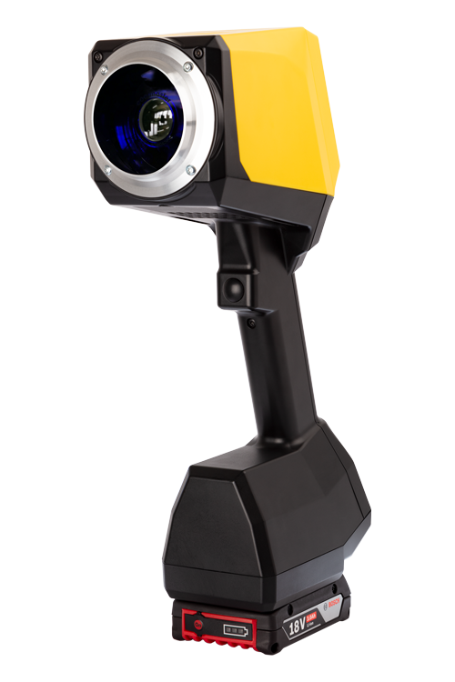

# Example App

This example demonstrates a more complex application with various UI components and data fetching from the Coatmaster Flex server.

## Functionality

-   **Fetches Configurations:** On startup, the app fetches the available measurement configurations from the device.
-   **UI Components:** It showcases the usage of `FlexList`, `FlexComboBox`, `FlexTextInput`, and `FlexCheckbox`.
-   **Measurement:** It allows taking measurements and displays the result.
-   **Busy Indicator:** It shows a busy indicator while loading data or taking a measurement.

## Files

-   `App.qml`: The main application file containing all the UI and logic.
-   `coatmasterFlex.png`: An image used as a background in the app.

## Screenshot

